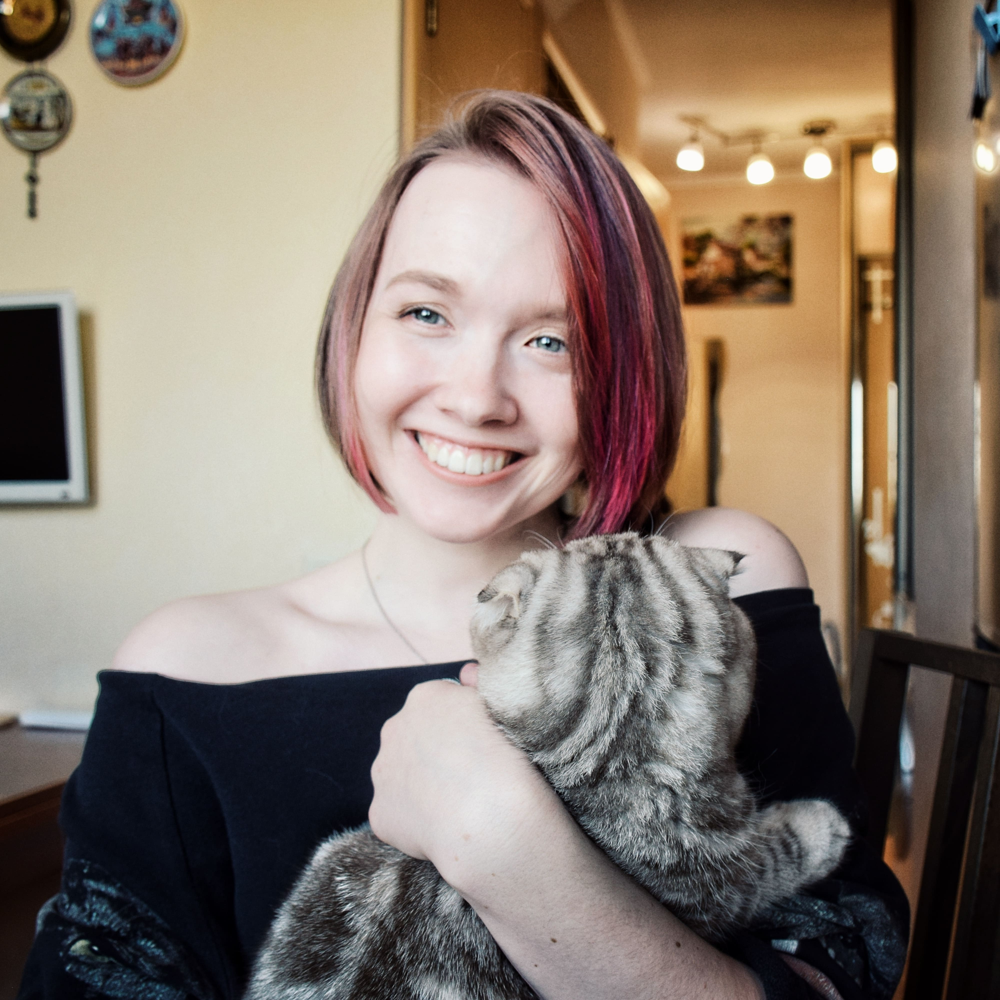

**First name and last name:** Julia Volkova;

I am a beginner **frontend developer**.

**My soft skills**  
1.*Communication:* Excellent oral and written communication skills, sociability, strong emotional intelligence.  
2.*Analytical thinking:* I'm good at figuring out complex problems, paying attention to the little details, and not being afraid to face challenges.  
3.*Teamwork:* Empathy, thoughtfulness, decision-making skills, ability to find compromises, flexibility, diplomacy, asking questions, and accepting criticism.  
4.*Time management and organization:* Ability to plan time and set priorities.  
5.*Learning and adaptability:*   
I have explored various professions, including trying myself as a lawyer, a file clerk, an administrative assistant, and even completed a copywriting course.   
I have worked in different companies and teams, and I can easily adjust to new environments, forming new connections.   
I welcome feedback and enjoy learning and growing in different fields. I prioritize dedicating a significant amount of time to my education because I genuinely enjoy the process of learning.  
6.*Proactivity and initiative:* I accomplish assigned tasks, have the ability to identify errors, and actively seek and propose solutions to address them.  

**Contacts**

1.*Telegram:* @JuliaVolkova
2.*E-mail:* juliavolk96@gmail.com

